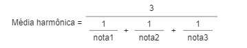

# LISTA DE EXERCÍCIOS DE OPERADORES, TIPOS E CONDICIONAIS

# OBJETIVOS
ꟷ Praticar o uso de operadores de atribuição, relacionais e aritméticos.
ꟷ Fixar a criação de pequenos algoritmos para resolução de problemas de lógica de programação.

# EXERCÍCIOS

1. Escreva um algoritmo que leia um número digitado pelo usuário e mostre a
mensagem “Número maior do que 10!”, caso este número seja maior, ou “Número
menor ou igual a 10!”, caso este número seja menor ou igual.

2. Escreva um algoritmo que leia dois números digitados pelo usuário e exiba o
resultado da sua soma.

3. Escreva um algoritmo que leia os valores de dois números inteiros distintos nas
variáveis A e B e informe qual deles é o maior. Caso os números sejam iguais informar
ao usuário que a sequência de números informados é inválida.

4. Escreva um algoritmo que leia dois números e ao final mostre a soma, subtração,
multiplicação e a divisão dos números lidos.

5. Leia valores nas variáveis A e B, e efetue a troca dos valores de forma que o valor
da variável A passe a ser o valor da variável B e o valor da variável B passe a ser o
valor da variável A. Apresentar uma mensagem com o valor original de cada variável
e outra com os valores trocados.

6. Ler uma temperatura em graus Celsius e apresentá-la convertida em graus
Fahrenheit. A fórmula de conversão é:
F = (9 * C + 160) / 5

7. Escreva um algoritmo que leia um número e diga, através de uma mensagem, se
este número está no intervalo entre 100 e 200. Caso o número esteja fora do intervalo
o usuário também deverá ser informado.

8. Escreva um algoritmo que leia um número e mostre uma mensagem caso este
número seja maior ou igual a 50, outra se ele for menor que 50.

9. Leia dois números nas variáveis A e B e identifique se os valores são iguais ou
diferentes. Caso eles sejam iguais imprima uma mensagem dizendo que são iguais.
Caso sejam diferentes, informe que são diferentes e qual número é o maior.

10. Escreva um algoritmo que leia um número de 1 a 5 e escreva-o por extenso. Caso
o usuário digite um valor que não esteja neste intervalo, exibir a mensagem: “Número
inválido!”.

11. Escreva um algoritmo que leia três valores inteiros distintos e escreva-os em
ordem crescente.

12. Escreva um algoritmo que receba o número do mês e mostre o mês
correspondente. Valide mês inválido.

13. Escreva um algoritmo que leia valores REAIS nas variáveis A e B e o tipo de
operador em outra variável do tipo CARACTERE. Imprima o resultado da operação
de A por B se o operador aritmético for válido; caso contrário deve ser impresso uma
mensagem de operador não definido. Tratar erro de divisão por zero.

14. A expressão an = a1 + (n – 1) * r é denominada termo geral da Progressão
Aritmética (PA). Nesta fórmula, temos que an é o termo de ordem n (n-ésimo termo),
r é a razão e a1 é o primeiro termo da Progressão Aritmética. Escreva um algoritmo
que encontre o n-ésimo termo de uma progressão aritmética. Exemplo: a1 = 10, n =
7, r = 3. Resultado: an = 28

15. Tendo como dados de entrada dois pontos quaisquer no plano, P1(x1, y1) e P2(x2,
y2), calcule e retorne a distância entre eles. A fórmula que efetua tal cálculo é: 
d = raiz(((x2 - x1)²) + ((y2 - y1)²)). Exemplo: p1(0, 5), p2(10, 20). Distancia: 18,03

16. Elabore um algoritmo que receba três notas de um aluno e retorne a sua média
aritmética. Exemplo: nota1 = 10.0, nota2 = 5.5, nota3 = 8.0. Média: 7.83

17. Elabore um algoritmo que receba três notas de um aluno os pesos referentes a
cada nota e retorne a sua média ponderada. Veja o cálculo da média ponderada:
Média ponderada =
nota1 * peso1 + nota2 * peso2 + nota3 * peso3
peso1 + peso2 + peso3
Exemplo: nota1 = 10, nota2 = 5.5, nota3 = 8, peso1 = 5, peso2 = 3, peso3 = 2
Média ponderada = 8.25

18. Elabore um algoritmo que receba três notas de um aluno e retorne a sua média
harmônica.

Exemplo: nota1 = 10, nota2 = 5.5, nota3 = 8
Média: 7.37

19. Faça um algoritmo que receba o raio e a altura de um cilindro e retorne o seu
volume calculado de acordo com a seguinte fórmula: volume = 3.14 * raio2
* altura;
Exemplo: raio = 10, altura = 15. Volume = 4710

20. Elabore um algoritmo que calcule a quantidade de litros de combustível gasta em
uma viagem, utilizando um automóvel que faz 12km por litro e considerando que são
fornecidos o tempo em hora e a velocidade média da viagem.
